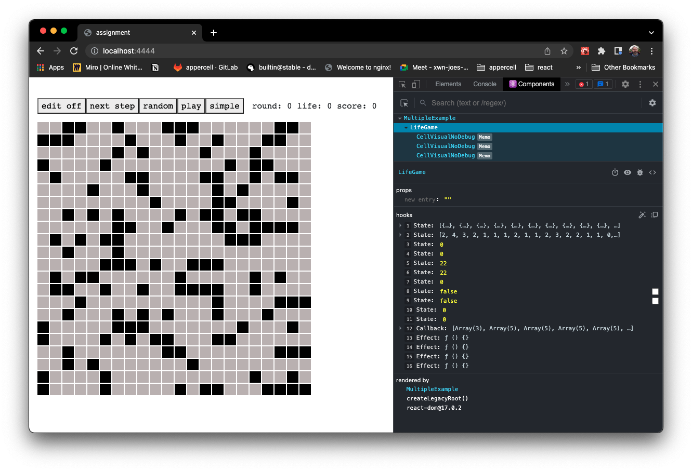
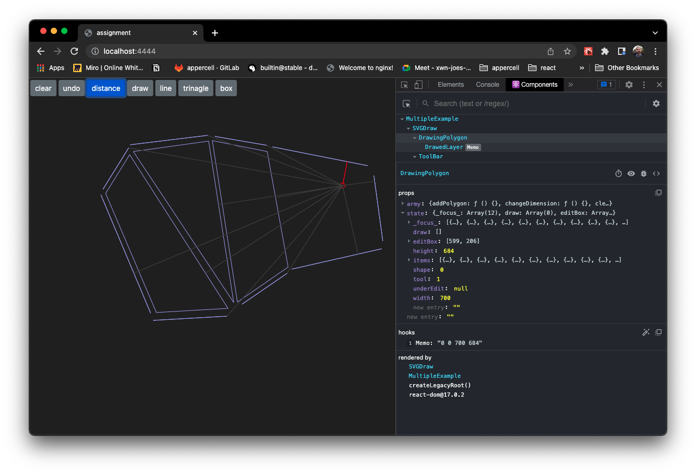

# react-troll
react useReducer organizator


*"the troll eated dispatch"*

## Benefit
My real world experience with react-troll is show the real difference between multiple useState, and useReducer, which is the core idea of this library.

In ```chrome devtool``` you can check, why this method is much more standard.

### *whitout useReducer*


### *with useReducer*


## Typescript
Already I makeed few react typescript ```example``` project, about react-troll in real action. 

Example assigments 
  - [Trivia Challenge](https://github.com/Pengeszikra/trivia-chellenge-assignment)
  - [SVG drawing](https://github.com/Pengeszikra/svg-draw-assignment)
  - [Life Game](https://github.com/Pengeszikra/live-game-assignment) *under construct*


*So I will make the typescript version of react-troll*

> under this line all information is a little bit out dated.

## base idea of troll
React best state manegement hook is useReducer, without this helper library you can use very well.
After application complexity groving in time, this troll woll be handy. Because give a simple control to you!

## troll : deconstruction - optional

As other hooks use power of array decunstruction, react-troll also give naming to your hand:
because useTroll return with state and setOfActions - action creator with dispatch - array:
```jsx
  const [state, setOfActions] = useTroll(reducer, init, actionsLookup);
```
But when you dosn't deconstruct immedietley, instead:
```jsx
  const troll = useTroll(reducer, init, actionsLookup);

  return <InteractiveComponent troll={troll} />
```
Then you know your component reach your state and actions which they need.
Also can pass troll to down her childrens.
```jsx
export const InteractiveComponent = ({troll:[{a, b, c}, {aAction, bAction}]}) => {
  useEffect(_ => bAction,[b]);
  return <div onClick={_ => aAction(c)}>{a}</div>;
}
```

## For example:

```jsx
import React from 'react';
import {useTroll} from 'react-troll';
import {fooReducer, fooInit, fooActionSet} from 'fooTroll';

const troll = useTroll(fooReducer, fooInit, fooActionSet);

return (
  <main>
    <FooNavigation troll={troll} />
    <FooApplication troll={troll} title="foo item set" className="foo-application" />
  </main>
);
```

```jsx
import {actionFactory, kebabToCamelCase} from 'react-troll';

export const [getActionsLookup, action] = actionFactory(kebabToCamelCase);
export const 
  GENERATE_NEW_ITEM = action('generate-new-item'),
  REMOVE_ITEM = action('remove-item')
;

export const fooInit = {
  items: [];
}

const randomId = _ => Math.random().toString(32).slice(-8);

export const fooReducer = (state, {type, payload}) => {
  switch (type) {
    case GENERATE_NEW_ITEM: 
      const id = randomId();
      return {...state, items:[...state.items, {id, label: `my id is: ${id}`}]};
    case REMOVE_ITEM: 
      return {...state, 
        items: state.items.filter(({id}) => id != payload);
      };
    default: return state;
  }
}
```

```jsx
import React from 'react';

export const FooApplication = ({troll, title, ...props}) => {
  const [state, actions] = troll;
  const {items} = state;
  const {generateNewItem, removeItem} = actions;

  return (
    <section {...props}>
      <h1>{title}</h1>
      <button onCLick={ _ => generateNewItem}>add item</button>
      {items.map(({id, label}) => <span key={id}>{label} <span onClick={_ => removeItem(id)}>X</span></span>)}
    </section>
  )
};
```